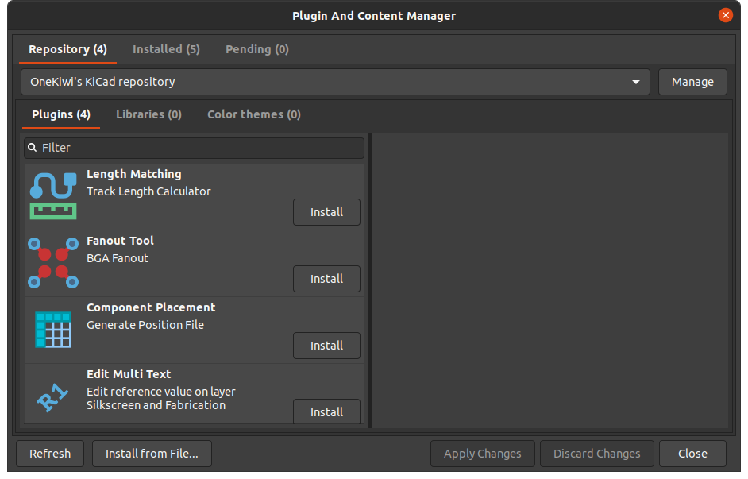

# OneKiwi's KiCad Addon Package Repository

## Installation 💾

Add our custom repo to **the Plugin and Content Manager**, the URL is `https://raw.githubusercontent.com/thanhduongvs/kicad-repository/main/repository.json`

From there you can install the plugin via the GUI.